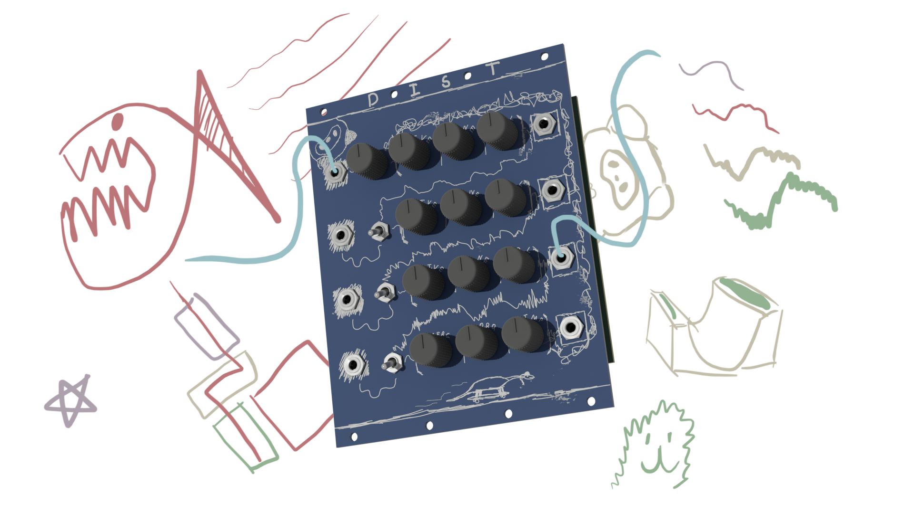
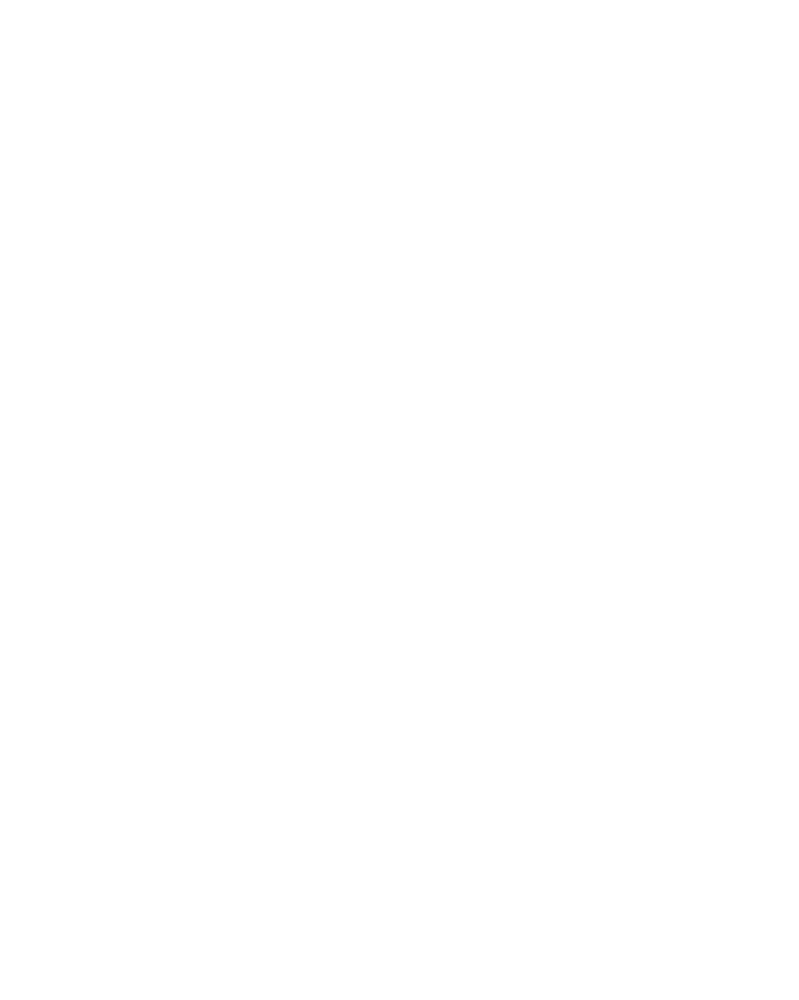
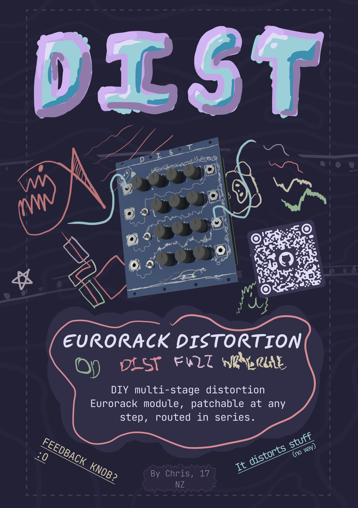

# DIST

_DIY multi-stage distortion Eurorack module, overdrive, distortion, fuzz, wrmergle, and any combination of them in one handy package_

#### What?
Where VCO was minimal, DIST is maximal! This is a module featuring four different distortion circuits, routed in series with inputs and outputs at every stage in the chain. The four circuits are:
1. Overdrive - Inspired by the Boss SD-1, but with a different tone section and diodes.
2. Distortion - Partly inspired by the RAT, again, many tweaks were made. 
3. Fuzz - Big Muff PI my beloved, slightly different architecture and transistors but still keeping the best tone section in effect I've seen.
4. Wrmergle - A fully custom, from scratch design based on internal feedback, with an adjustable noise gate for your convenience :)

Every circuit has a gain, tone, and volume control, as well as a switch deciding whether to take input from the previous section or from the input jack. The overdrive has a potentiometer instead of a switch, setting an overall feedback control for more fun effects.

#### Why?
Distortion is quite literally the best effect, but no one pedal gives quite enough for me lol. This module has various features which enable absolutely ridiculous gains, while still having some playability due to the noise gate. I also like the idea of having it patchable at any point, as it means you can pick and choose how much distortion (and of what types) you want, or even just use it as 4 seperate distortions in parallel. 

Its definitely a big module, but you do get an absolute crapton of features and control, which is always nice to have.

#### How to use?
The jacks on the left side are the inputs, and on the right the corresponding outputs.
Each section is routed into the next, and you can toggle between using the input jack or the previous stage as input using the switch. The top left knob controls the overall feedback, as in how much of the output of the **WRMERGLE** stage goes to the input of the **OD** stage. 

Generally, you should be able to find your way around by following the signal path on the front board.

#### Simulations
I've included the simulations I created on LTSpice; *od.asc*, *dist.asc*, *fuzz.asc*, and *wrmergle.asc* contain their respective distortion stages, *gate.asc* contains the gate circuit of the **WRMERGLE** section, and *structure.asc* is a pseudo-layout of the whole circuit (not functional).

There is also a livespice simulation of the **OVERDRIVE** section, but I opted not to further utilise this tool due to lack of cross platform support and performance limitations.

## Renders

## Zine Page

## BOM
_Needed is how many I personally need :)_
| Part                             | Quantity | Needed | Source     | Link                                                                                                                                                                 | Lot / Min Amount | Unit    | Net     | Running |
|----------------------------------|----------|--------|------------|----------------------------------------------------------------------------------------------------------------------------------------------------------------------|------------------|---------|---------|---------|
| **Capacitors**                       |          |        |            |                                                                                                                                                                      |                  |         |         |         |
| 1n Cap, 0805                     | 6        | 6      | JLCPCB     | https://jlcpcb.com/partdetail/47657-CL21B102KBCNNNC/C46653                                                                                                           | 1                | $0.0112 | $0.0672 | $0.07   |
| 4.7n Cap, 0805                   | 3        | 3      | JLCPCB     | https://jlcpcb.com/partdetail/2096-0805B472K500NT/C1744                                                                                                              | 1                | $0.0066 | $0.0198 | $0.09   |
| 10n Cap, 0805                    | 2        | 2      | JLCPCB     | https://jlcpcb.com/partdetail/2062-CL21B103KBANNNC/C1710                                                                                                             | 1                | $0.0082 | $0.0164 | $0.10   |
| 22n Cap, 0805                    | 2        | 2      | JLCPCB     | https://jlcpcb.com/partdetail/2081-CL21B223KBANNNC/C1729                                                                                                             | 1                | $0.0097 | $0.0194 | $0.12   |
| 100n Cap, 0805                   | 19       | 19     | JLCPCB     | https://jlcpcb.com/partdetail/YAGEO-CC0805KRX7R9BB104/C49678                                                                                                         | 1                | $0.0066 | $0.1254 | $0.25   |
| 220n Cap, 0805                   | 13       | 13     | JLCPCB     | https://jlcpcb.com/partdetail/5810-CL21B224KBFNNNE/C5378                                                                                                             | 1                | $0.0122 | $0.1586 | $0.41   |
| 1u Cap, 0805                     | 1        | 1      | JLCPCB     | https://jlcpcb.com/partdetail/29074-CL21B105KBFNNNE/C28323                                                                                                           | 1                | $0.0165 | $0.0165 | $0.42   |
| 1u Electrolytic Cap, P1.5xD4.0   | 4        | 0      | LCSC       | https://www.lcsc.com/product-detail/C216323.html?spm=wm.fly.bg.2.xh___wm.sy.dhl.mly.12-0-1&lcsc_vid=QgdcVwJXRQJWBFFSFgMKBQVWEgAMVVEFTgQNA1ZXFlkxVlNeR1JeV1RVRlFaVTtW | 50               | $0.0185 | $0.0000 | $0.42   |
| 2.2u Electrolytic Cap, P1.5xD4.0 | 1        | 0      | LCSC       | https://www.lcsc.com/product-detail/C43343.html                                                                                                                      | 50               | $0.0151 | $0.0000 | $0.42   |
| 4.7u Electrolytic Cap, P1.5xD4.0 | 3        | 0      | LCSC       | https://www.lcsc.com/product-detail/C2873979.html                                                                                                                    | 50               | $0.0114 | $0.0000 | $0.42   |
| 10u Electrolytic Cap, P1.5xD4.0  | 3        | 0      | LCSC       | https://www.lcsc.com/product-detail/C503219.html                                                                                                                     | 50               | $0.0143 | $0.0000 | $0.42   |
| **Resistors**                        |          |        |            |                                                                                                                                                                      |                  |         |         |         |
| 47? Resistor, 0805               | 2        | 2      | JLCPCB     | https://jlcpcb.com/partdetail/18402-0805W8F470JT5E/C17714                                                                                                            | 1                | $0.002  | $0.0030 | $0.43   |
| 150? Resistor, 0805              | 2        | 2      | JLCPCB     | https://jlcpcb.com/partdetail/18159-0805W8F1500T5E/C17471                                                                                                            | 1                | $0.0016 | $0.0032 | $0.43   |
| 560? Resistor, 0805              | 5        | 5      | JLCPCB     | https://jlcpcb.com/partdetail/29388-0805W8F5600T5E/C28636                                                                                                            | 1                | $0.0019 | $0.0095 | $0.44   |
| 1k? Resistor, 0805               | 10       | 10     | JLCPCB     | https://jlcpcb.com/partdetail/18201-0805W8F1001T5E/C17513                                                                                                            | 1                | $0.0021 | $0.0210 | $0.46   |
| 1.5k? Resistor, 0805             | 1        | 1      | JLCPCB     | https://jlcpcb.com/partdetail/4717-0805W8F1501T5E/C4310                                                                                                              | 1                | $0.0015 | $0.0015 | $0.46   |
| 2.2k? Resistor, 0805             | 2        | 2      | JLCPCB     | https://jlcpcb.com/partdetail/18208-0805W8F2201T5E/C17520                                                                                                            | 1                | $0.0015 | $0.0030 | $0.46   |
| 4.7k? Resistor, 0805             | 1        | 1      | JLCPCB     | https://jlcpcb.com/partdetail/18361-0805W8F4701T5E/C17673                                                                                                            | 1                | $0.0016 | $0.0016 | $0.47   |
| 6.8k? Resistor, 0805             | 1        | 1      | JLCPCB     | https://jlcpcb.com/partdetail/18460-0805W8F6801T5E/C17772                                                                                                            | 1                | $0.0017 | $0.0017 | $0.47   |
| 10k? Resistor, 0805              | 10       | 10     | JLCPCB     | https://jlcpcb.com/partdetail/18102-0805W8F1002T5E/C17414                                                                                                            | 1                | $0.0020 | $0.0200 | $0.49   |
| 22k? Resistor, 0805              | 2        | 2      | JLCPCB     | https://jlcpcb.com/partdetail/18248-0805W8F2202T5E/C17560                                                                                                            | 1                | $0.0027 | $0.0054 | $0.49   |
| 39k? Resistor, 0805              | 4        | 4      | JLCPCB     | https://jlcpcb.com/partdetail/26569-0805W8F3902T5E/C25826                                                                                                            | 1                | $0.0018 | $0.0072 | $0.50   |
| 100k? Resistor, 0805             | 13       | 13     | JLCPCB     | https://jlcpcb.com/partdetail/160838-0805W8F1003T5E/C149504                                                                                                          | 1                | $0.0020 | $0.0260 | $0.53   |
| 150k? Resistor, 0805             | 1        | 1      | JLCPCB     | https://jlcpcb.com/partdetail/18158-0805W8F1503T5E/C17470                                                                                                            | 1                | $0.0018 | $0.0018 | $0.53   |
| 200k? Resistor, 0805             | 4        | 4      | JLCPCB     | https://jlcpcb.com/partdetail/18227-0805W8F2003T5E/C17539                                                                                                            | 1                | $0.0021 | $0.0084 | $0.54   |
| 220k? Resistor, 0805             | 2        | 2      | JLCPCB     | https://jlcpcb.com/partdetail/18244-0805W8F2203T5E/C17556                                                                                                            | 1                | $0.0017 | $0.0034 | $0.54   |
| 470k? Resistor, 0805             | 3        | 3      | JLCPCB     | https://jlcpcb.com/partdetail/18397-0805W8F4703T5E/C17709                                                                                                            | 1                | $0.0015 | $0.0045 | $0.54   |
| 1M? Resistor, 0805               | 1        | 1      | JLCPCB     | https://jlcpcb.com/partdetail/18202-0805W8F1004T5E/C17514                                                                                                            | 1                | $0.0010 | $0.0010 | $0.55   |
| 2.2M? Resistor, 0805             | 1        | 1      | JLCPCB     | https://jlcpcb.com/partdetail/26856-0805W8F2204T5E/C26113                                                                                                            | 1                | $0.0033 | $0.0033 | $0.55   |
| **Diodes**                           |          |        |            |                                                                                                                                                                      |                  |         |         |         |
| 1N4148WS, SOD-323                | 12       | 12     | JLCPCB     | https://jlcpcb.com/partdetail/2485-1N4148WS/C2128                                                                                                                    | 1                | $0.0092 | $0.1104 | $0.66   |
| **Other Components**                 |          |        |            |                                                                                                                                                                      |                  |         |         |         |
| TL072CDT                         | 7        | 7      | JLCPCB     | https://jlcpcb.com/partdetail/STMicroelectronics-TL072CDT/C6961                                                                                                      | 1                | $0.1570 | $1.0990 | $1.76   |
| 100k? Potentiometer, �RK09K�     | 14       | 14     | Aliexpress | https://www.aliexpress.com/item/1005007278123055.html                                                                                                                | 5                | $0.2080 | $3.1200 | $4.88   |
| SPDT Switch                      | 3        | 3      | Aliexpress | https://www.aliexpress.com/item/1005005370002265.html                                                                                                                | 5                | $0.8520 | $4.2600 | $9.14   |
| PJ301M-12 Audio Jack             | 8        | 8      | Aliexpress | https://www.aliexpress.com/item/1005004864182675.html                                                                                                                | 10               | $0.4440 | $4.4000 | $13.54  |
| 2x08 IDC Connector               | 1        | 0      | LCSC       | https://www.lcsc.com/product-detail/C7430313.html                                                                                                                    | 5                | $0.0993 | $0.0000 | $13.54  |
| 100k? Trimpot, �3362p�           | 1        | 1      | Aliexpress | https://www.aliexpress.com/item/1005010523079544.html                                                                                                                | 10               | $0.4480 | $4.4800 | $18.02  |
| BC547B NPN BJT                   | 4        | 0      | LCSC       | https://www.lcsc.com/product-detail/C713613.html                                                                                                                     | 10               | $0.0495 | $0.0000 | $18.02  |
| BSP89 N-MOSFET                   | 1        | 1      | JLCPCB     | https://jlcpcb.com/partdetail/VBsemiElec-BSP89VB/C20755324                                                                                                           | 1                | $0.5565 | $0.5565 | $18.57  |
| **Other**                            |          |        |            |                                                                                                                                                                      |                  |         |         |         |
| PCB                              | 1        | 1      | JLCPCB     | NA                                                                                                                                                                   | 5                | $1.6600 | $8.3000 | $26.87  |
| Aluminium Plate (100x200x2mm)    | 1        | 1      | Aliexpress | https://www.aliexpress.com/item/1005007160296738.html                                                                                                                | 1                | $6.2300 | $6.2300 | $33.10  |
| Total                            |          |        |            |                                                                                                                                                                      |                  |         |         | $33.10  |

| Totals                          | Money  |
|---------------------------------|--------|
| Aliexpress, Inc. Shipping + Tax | $24.57 |
| JLCPCB, Inc. Shipping + Tax     | $38.84 |
| Total                           | $63.41 |

## CAD Links
Heres the links to the CAD source, Onshape:
[Panel source](https://cad.onshape.com/documents/a7eabe2ba59f8201542a9705/w/4e0a52924acb1733bd85ab30/e/c5b387347f991d36168a8bde?renderMode=0&uiState=6a1f772945aecca6290d22e6)

## Directory Structure
- **hardware/**
    - **bom/** - BOM Files (CSV and LibreOffice Calc)
    - **cad/** - CAD Files
        - **render/** - Files for rendering (inc. gltf models)
    - **dist/** - KiCad files
        - **lib/** - External libraries
        - **production/** - Production files (Gerber, etc.)
    - **livespice/** - LiveSpice electrical simulations
    - **ltspice/** - LTSpice electrical simulations
- **journals/**
- **zine/** - Zine page

## References
Circuit design influenced by:
[Electric Druid Classic OD](https://electricdruid.net/designing-a-classic-overdrive/)
[Boss SD-1](https://www.hobby-hour.com/electronics/s/sd1-super-overdrive.php)
[RAT](https://www.electrosmash.com/proco-rat)
[Big Muff PI](https://www.bigmuffpage.com/Big_Muff_Pi_versions_schematics_part1.html)
[One Knob Noise Gate](https://effectslayouts.blogspot.com/2016/07/one-knob-noise-gate.html)